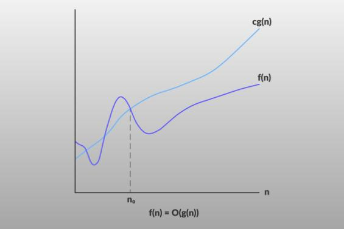
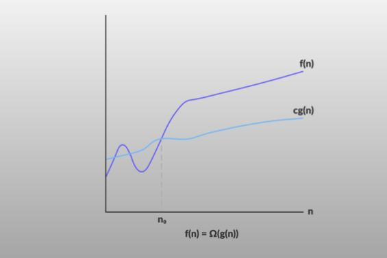
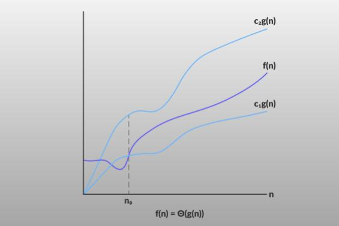

## What is algorithm ?

Finite set of rules to solve a problem is called algorithm.

## Analysis of Algorithms

Analysis is aprocess of comparing two algorithms wrt time and space.

Analysis of algorithms can be done in two ways

1. Priory
2. Posterory

| Priory                          | Posterior                      |
| ------------------------------- | ------------------------------ |
| Before Execution of the program | After Execution of the program |
| General time                    | Exact time                     |
| Hardware independent            | Depends on hardware            |
| Most used                       | less reliable                  |
| Uniform Value                   | Value depend on hardwares      |

## Asyptotic Notation

It is a Mathematical way to represent the time and space complexity of an algorithm.

We analyze the algorithm without execution(Prior analysis).

In algorithm there are mainly of three type of Notation

- Big-O Notation (O-notation)
- Omega Notation (Ω-notation)
- Theta Notation (Θ-notation)
- Little-O-Notation
- Little-Omega-Notation

### Big-O Notation (O-notation)

- Least upper bound

Big-O notation represents the upper bound of the running time of an algorithm.

It gives the worst-case complexity of an algorithm.



```
if we have a function f(n) and we have to write it in order og g(n) then

f(n) = O(g(n))
then f(n) <= C.g(n)

Where: C > 0
       n >= k
       k >= 0
```

Example:

```
f(n) = 2n^2 + n
then 2n^2 + n <= 3.g(n^2)
                      |_____upper bound
Then we can write O(n^2)
```

### Big-Omega Notation (Ω-notation)

- Gretest lower bound

Omega notation represents the lower bound of the running time of an algorithm.

It provides the best case complexity of an algorithm.



```
if f(n) = Ω(g(n)) means f(n) >=C.g(n)
```

### Theta Notation (Θ-notation)

- Average value

it represents the upper and the lower bound of the running time of an algorithm.

It is used for analyzing the average-case complexity of an algorithm.



```
C1.g(n)>= f(n) >= C2.g(n)
```

## Properties of Asyptotic Notation

- Reflexive : if euality holds
- Symmetric : if a > b then b > a
- Transitive : a = b and b = c then a = c

|                              | Reflexive | Symmetric | Transitive |
| ---------------------------- | --------- | --------- | ---------- |
| Big-O <br>a<=b               | ✓         | χ         | ✓          |
| Big-Ω <br>a>=b               | ✓         | χ         | ✓          |
| Theta-Θ<br>c1.b <= a <= c2.b | ✓         | ✓         | ✓          |
| Little-O <br>a < b           | χ         | χ         | ✓          |
| Little-Ω <br> a > b          | χ         | χ         | ✓          |

## Comparision of various time complexity

| f(n)                         |
| ---------------------------- |
| O(c)                         |
| O(loglogn)                   |
| O(logn)                      |
| O(n<sup>1/2</sup>)           |
| O(n)                         |
| O(nlogn)                     |
| O(n<sup>2</sup>)             |
| O(n<sup>k</sup>)             |
| O(2<sup>n</sup>)             |
| O(n<sup>n</sup>)             |
| O(2<sup>2<sup>n</sup></sup>) |

**Note**:

- If anynnumber is given 10<sup>3</sup> and 10<sup>10</sup> the their order in term of algorithm is constant.
- If you are comparing two function the put very large value such as 10<sup>10</sup>

## [Cheat sheet of Time Complexity](https://www.bigocheatsheet.com/)

### data Structure

| Worst              | Access  | Search  | insertin | Deletion |
| ------------------ | ------- | ------- | -------- | -------- |
| Array              | O(1)    | O(n)    | O(n)     | O(n)     |
| Stack              | O(n)    | O(n)    | O(1)     | O(1)     |
| Queue              | O(n)    | O(n)    | O(1)     | O(1)     |
| Singly-Linked-List | O(n)    | O(n)    | O(1)     | O(1)     |
| Doubly-Linked-List | O(n)    | O(n)    | O(1)     | O(1)     |
| Hash Table         | N/A     | O(n)    | O(n)     | O(n)     |
| Binary Search tree | O(n)    | O(n)    | O(n)     | O(n)     |
| B-Tree             | O(logn) | O(logn) | O(logn)  | O(logn)  |
| AVL-Tree           | O(logn) | O(nlog) | O(logn)  | O(logn)  |

### Important Algorithms Time Complexity

| Algorithm         | Time Complexity                             |
| ----------------- | ------------------------------------------- |
| Binary Search     | O(log(n))                                   |
| Sequential Serach | O(n)                                        |
| quick Sort        | Avg : O(nlog(n))<br>Worst: O(n<sup>2</sup>) |
| Merge Sort        | O(nlog(n))                                  |
| Insertion Sort    | O(n<sup>2</sup>)                            |
| Bubble Sort       | O(n<sup>2</sup>)                            |
| Heap Sort         | O(nlog(n))                                  |
| Selection Sort    | O(n<sup>2</sup>)                            |
| Height of CBT     | O(log(n))                                   |
| Insertion in Heap | O(log(n))                                   |
| Construct Heap    | O(nlog(n))                                  |
| Delete from Heap  | O(log(n))                                   |
| Huffman           | O(nlog(n))                                  |
| Krushkal          | O(E log(E))                                 |
| Prims             | O(n<sup>2</sup>)                            |
| BFS               | O(V + E)                                    |
| DFS               | O(V + E)                                    |
| Dijkstra's        | O(V<sup>2</sup>)                            |

## Recurrence relation

A recurrence relation is an equation that defines a sequence based on a rule that gives the next term as a function of the previous term(s).

The simplest form of a recurrence relation is the case where the next term depends only on the immediately previous term.

Example: Binary Search Algorithm

- Array must be sorted for Binary Search

```
BS(A, i, j, x):
    mid = (i + j) / 2

    if(A[mid]==x):return mid

    else if(A[mid]>x):
        BS(A, i, mid-1, x)

    else
        BS(A, mid+1, j, x)
```

- Taken an array find x =30

```
i-- 10 20 30 40 50 60 70 --j
             --
        mid = i + j /2
        mid =4
    check if A[4] == x ---> no
    then Chack A[4]>x --yes
    then BS(A, i, mid-1, x)

  i--10 20 30--j
      mid = i+j/2
      mid = 2
      check if(A[2]==x)--->no
      then check A[2]>x ---> No
      then check A[2]<x ---> yes
      then BS(A, mid+1,j, x);

      .
      .
      .
Here we have a patter
            n--->n/2--->n/4--->n/8--->n/16

T(n) = T(n/2) + C --- This is called recurrence Relation
```

## How to solve Recurence Relation

### 1. Substitution Method (Universal Way)

As per name we have to substitute the value into equations to get result.

Example-1: T(n) = T(n/2) + C is recurrence relation for Binary search then

```
T(n) = T(n/2) + c ---------1
for n/2
T(n/2) = T(n/4) + C -------2
for n/4
T(n/4) = T(n/8) + C -------3

Substitute 2 in 1
T(n) = T(n/4) + 2C --------4
Substitute 3 in 4
T(n) = T(n/8) + 3c

Now For K time substitution
T(n) = T(n/2^k) + KC

Now we have to eliminate RHS T(n/2^k) such that T(1) = 1

n = 2^k
logn  = k

T(n) = 1 + Clogn

So we can write O(logn) is time complexity of Binary search

```

### 2. Master Method

Master Method is a direct way to get the solution.

Master method only works on these type of problem

> ```
> T(n) = aT(n/b) + f(n) where a >= 1 and b > 1
> ```

Then we can write Recurence Relation as

> ### T(n) = n<sup>log<sub>b<sup>a</sup></sub></sup>[U(n)]

where U(n) depands on h(n) and

> ### h(n) = f(n)/n<sup>log<sub>b<sup>a</sup></sub></sup>

Relation between h(n) and U(n)

| h(n)                       | U(n)                          |
| -------------------------- | ----------------------------- |
| n<sup>r</sup><br>r > 0     | O(n<sup>r</sup>)              |
| n<sup>r</sup><br>r <> 0    | O(1)                          |
| log(n)<sup>i</sup><br>i>=0 | O(log<sub>2<sup>n</sup></sub> |

Example 1:

```
T(n) = 8 T(n/2) + n^2

here a = 8 b = 2 f(n) = n^2

then based on master theorem
x= n^logb(a)
x = n^log2(8)
x = n^3

then T(n) = n^3[U(n)]

and U[n] depends on h(n)

h(n) = f(n)/x = 1/n

hence h(n) = n^-1 then second case in table

U(n) = O(1)

T(n) = n^3(O(1))

T(n) = n^3

time complexity will be O(n^3)
```

Example2 :

```
T(n) = T(n/2) + c<----binary search
a = 1 b = 2 f(n) = c

Based on master theorem
x= n^logb(a)
x = n^log2(1)
x = 1

T(n) =n(U(n))
T(n) = U(n)

Now U(n) depends on h(n)

h(n) = f(n)/x
h(n) = c

based on table it is case 3 where n = 0
so h(n) = (log2(n)^0).c <---must write in this form

 then U(n) = (log2(n)^(i+1))/(i+1)
 U(n) = log2(n).c

 thenorder is O(logn)
```
